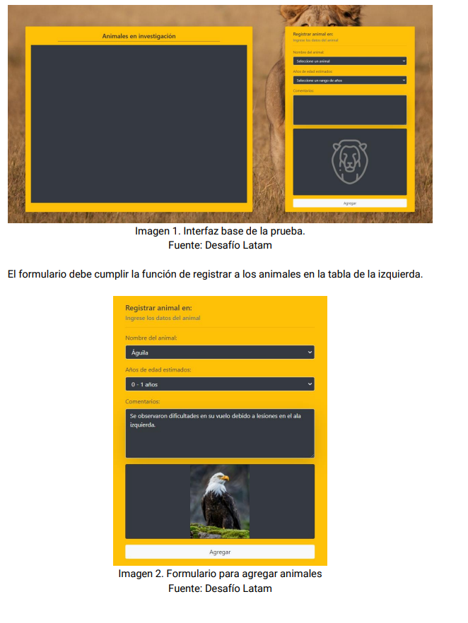
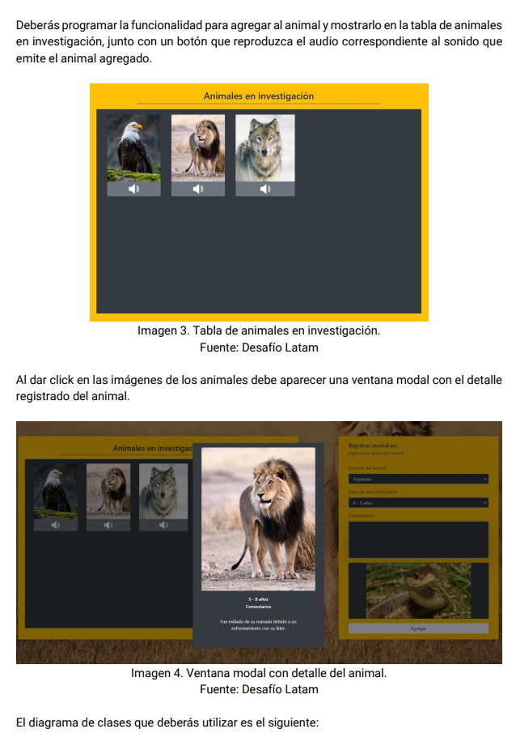
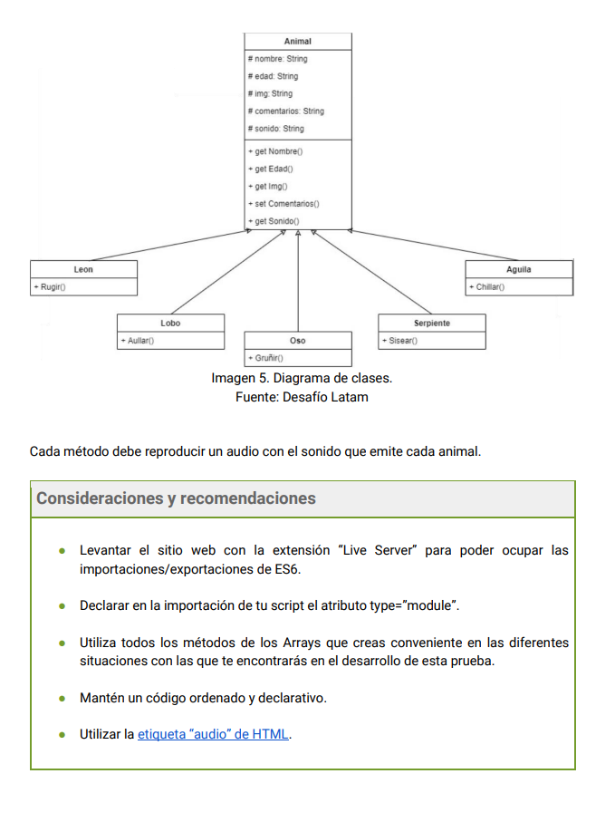

# Prueba - Animales Salvajes

En esta prueba validaremos nuestros conocimientos de Crear clases con herencias, Exportar
e importar módulos, Crear funciones autoejecutables IIFE, Crear funciones async / await,
Crear instancias de clases, Obtener y modificar elementos del DOM.

## Descripción

En Australia se están realizando investigaciones con algunos animales salvajes y necesitan
crear un sitio web que permita registrar los comentarios de los investigadores. En esta prueba
deberás crear una aplicación web que permita agregar en una tabla los animales en
investigación, utilizando el paradigma POO para la creación de las instancias que representen
los diferentes animales con sus atributos y métodos.
En la sección de documentos contarás con un Apoyo Prueba - Animales Salvajes que
contiene todos los archivos necesarios para la realización de la prueba. A continuación verás
diferentes imágenes que demuestran las interacciones que deberás desarrollar en la
aplicación.

Requerimientos:

1. Crear las clases representadas en el diagrama implementando la herencia indicada.
   (2 Puntos)
2. Crear las instancias de las clases utilizando los datos del formulario.
   (2 Puntos)
3. Realizar una consulta asíncrona utilizando una función async/await para obtener las
   imágenes correspondientes a los animales. (1 Punto)
4. Realizar por lo menos una función autoejecutable IIFE. (1 Punto)
5. Dividir el código en módulos (2 Puntos)
6. Utilizar la manipulación del DOM para mostrar en la tabla los animales registrados con
   el formulario. (2 Puntos)
7. Validar que el usuario haya asignado todos los datos del animal antes de que éste sea
   agregado a la tabla. (Opcional)
8. Devolver el formulario en un estado inicial luego de registrar a cada animal. (Opcional)
9. Programar la interacción del botón de audio, en donde deberás reproducir el sonido
   del animal en el sitio web. (Opcional)
10. Mostrar el detalle de cada animal en una ventana modal al ser presionada su imagen.
    (Opcional)





## Empezando 🚀

Estas instrucciones te guiarán para obtener una copia de este proyecto en funcionamiento en tu máquina local para propósitos de desarrollo y pruebas.

```bash
git clone [https://github.com/LorenaOvalle/Prueba-Animales-Salvajes]

### Pre-requisitos 📋

Lista de software y herramientas, incluyendo versiones, que necesitas para instalar y ejecutar este proyecto:

- Sistema Operativo (por ejemplo, Ubuntu 20.04, Windows 10, MacOS 10.15)
- Navegador (Firefox, Chrome, Safari)
```
